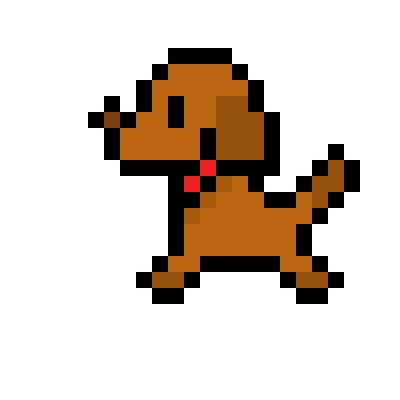

Criando **minha** _página_ ~~principal~~.

# Quem sou eu

Sou um estudante de jogos que gosta muito DAS AULAS DO PROF MARCELO.  
  
# Portfolio

## Games

[Jogo 1 Oficina : SUPER](https://zevictor.github.io/CapWhite/)  
[Love&Code](https://zevictor.github.io/Love&Code/)  

## Artes

  
  

## Apresentações
* Aula de Música
* Aula de Teatro
* Aula de Jogos
1. Marcelo
2. Durval
3. Tiago

* * *

** negrito  
_  italico  
~~ riscado  
   dois espaços p/ pular linha  
3* adiciona uma linha horizontal  
#s uma ou mais hashtags criam capítulos ou sub  
*s asteriscos adicionam uma lista não numerada  
1s numeros adicionam uma lista numerada  

* * *
